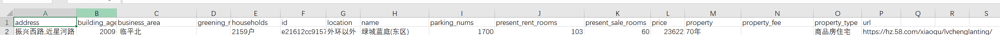
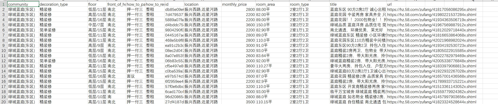
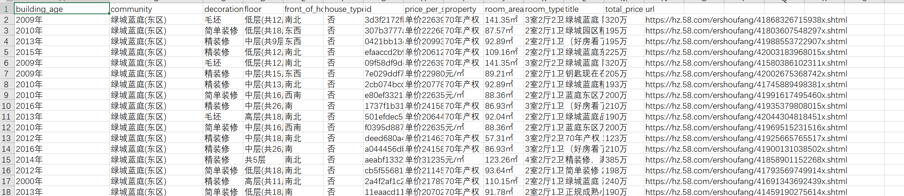

# 58同城爬虫

## What Is It

58同城城市房屋信息爬虫。本爬虫使用[scrapy](https://scrapy.org/)框架快速搭建，实现了网页信息到CSV表格的功能（如遇excel打开乱码，可以使用文本编辑工具修改编码格式为gbk后，重新保存打开）。

小区信息：



租房信息：



二手房信息：



## How To Use

1. 打开settings.py目录，补全城市信息和动态IP代理，
    ```
    CITY = 'hz'

    PROXY_SERVER = ""
    PROXY_USER = ""
    PROXY_PASSWORD = ""
    ```

2. 使用命令行，运行爬虫脚本。
    ```shell
    scrapy crawl city58
    ```

## 说明

本代码仅作学习交流，切勿用于商业用途，否则后果自负。如有侵权，联系删除。