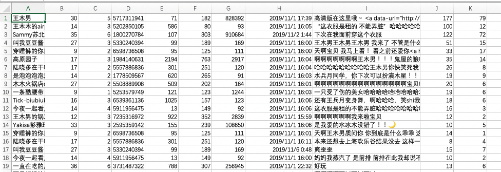
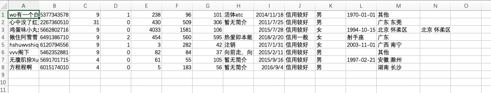

# 一只微博爬虫（m.weibo.cn）

## What is it

一只慢悠悠的m.weibo.cn的爬虫，它能做：

1. 爬取指定博文的所有评论（评论用户，用户等级，会员等级，用户id，微博数，关注数，粉丝数，评论时间，评论内容，评论点赞数，评论回复数)
    
2. 爬取指定用户的详细信息（用户名，用户id，用户等级，会员等级，微博数，关注数，粉丝数，简介，注册时间，阳光信用，性别，生日，所在地，家乡，大学，公司）
    

**特点**：

1. 直接在m.weibo.cn中登录，省去prelogin获取serverdata的步骤，省去解密用户名和密码的过程，代码简洁易懂，容易修改。

**说明**：

- 微博显示的评论数和用户能查看到的实际评论数是不一致的，例如评论为1w+，实际真实用户看到只能1k+，那么该爬虫也能爬取到1k+的评论内容。

- 如有侵权，联系删除。

## How To Use

```python
weibo = Weibo('xxxx@xxx.xxx', 'password++++')
weibo.login()
# 例如 https://m.weibo.cn/detail/4433839998710387 的blog_id为 4433839998710387
weiboSpider.start_for_cmt_info('4433839998710387', '4433839998710387.csv')

# 爬取指定用户id的基本信息（传入用户id的List）
userIdList = ['5377343578', '2267360510', '5662802716', '6491386710', '6120794556', '5462352881', '5691701715', '6015174010']
weiboSpider.start_for_user_info(userIdList, 'userinfo.csv')

```